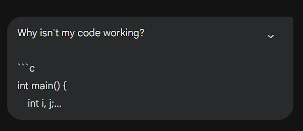
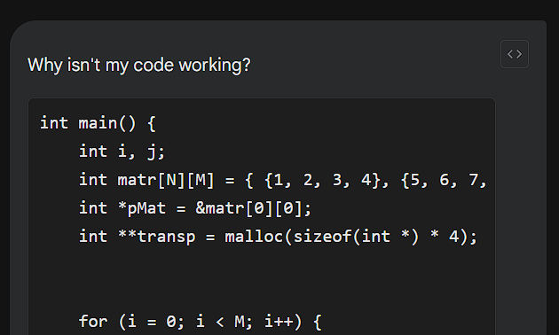

# Gemini Prompt Renderer

 

A Tampermonkey Userscript that automatically renders Markdown structures (code blocks, tables, formatting) in messages sent by the user on the Google Gemini Web interface.

Natively, Gemini displays your prompts as raw text, making it difficult to read complex code snippets or structured data you have just sent. This script solves that usability issue by rendering them properly.

## Features

- **Full Markdown Rendering**: Support for tables, lists, bold, italic, and headers.
- **Code Block Styling**: Code snippets are formatted with a dark background and monospaced font for better readability.
- **Raw/Rendered Toggle**: A floating button allows you to instantly switch between the original text (for editing/copying) and the rendered view.
- **Seamless Integration**: Styles are designed to match Google's Material Design and Gemini's native look and feel.

## Installation

1. Ensure you have the **Tampermonkey** extension installed in your browser ([Chrome](https://chromewebstore.google.com/detail/tampermonkey/dhdgffkkebhmkfjojejmpbldmpobfkfo) | [Firefox](https://addons.mozilla.org/en-US/firefox/addon/tampermonkey/)).
2. **[CLICK HERE TO INSTALL THE SCRIPT](https://github.com/samsilveira/gemini-prompt-renderer/raw/main/gemini-prompt-renderer.user.js)**.
3. Tampermonkey will open a tab asking for confirmation. Click **Install**.

## Screenshots

| Before (Raw Text) | After (Rendered) |
| :-----------------: | :----------------: |
|  |  |

## Usage

The script works automatically. Once you send a message or load a chat history:

1. Your message content will be formatted.
2. A small code icon `</>` (or eye icon) will appear in the top-right corner of your message bubble.
3. Click the icon to toggle between **Raw Mode** and **Rendered Mode**.

## Contributing

Suggestions and Pull Requests are welcome! If you find any rendering bugs or edge cases where the Markdown breaks, please open an [Issue](https://github.com/samsilveira/gemini-prompt-renderer/issues).

## License

Distributed under the MIT License. See `LICENSE` for more information.
